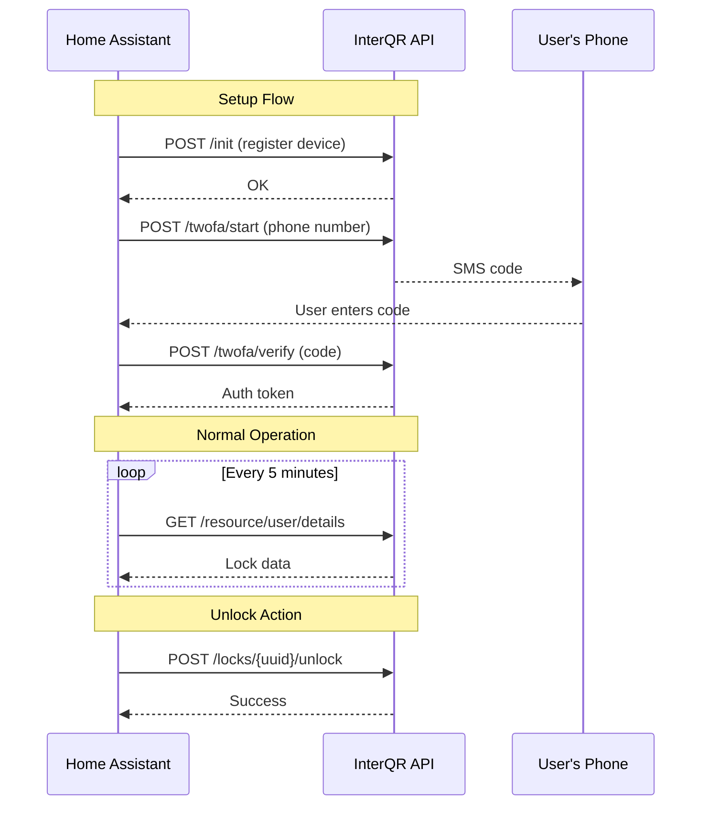

# InterQR

<p align="center">
  
</p>

<p align="center">
  <a href="https://github.com/your-repo/ha-interqr/releases"></a>
  <a href="https://github.com/your-repo/ha-interqr/blob/main/LICENSE"></a>
  
  
</p>

The **InterQR** integration allows you to control [InterQR](https://www.interqr.com/) smart locks from your Home Assistant instance. InterQR is a QR-code-based building access and smart lock system commonly used in residential buildings.

## Features

- 🔓 **Unlock** — Send unlock commands to any lock linked to your InterQR account
- 🔓⏱ **Long Unlock** — Extended-duration unlock for doors that support it (e.g., building gates)
- 🔄 **Auto-Refresh** — Polls the InterQR API every 5 minutes to keep lock data up to date
- 🔐 **Secure 2FA Setup** — SMS-based two-factor authentication during configuration
- 🔑 **Automatic Re-authentication** — Seamlessly refreshes expired tokens; falls back to full 2FA when needed
- 🏠 **Multi-Lock Support** — Discovers and creates entities for all locks on your account
- 🛡️ **Security Hardened** — HTTPS enforcement, input validation, SSRF prevention, rate limiting, and sanitized logging

## Prerequisites

- A working [Home Assistant](https://www.home-assistant.io/) installation (version 2024.1 or newer)
- An active InterQR account with at least one lock assigned
- A phone number registered with InterQR (for SMS verification)

## Installation

### HACS (Recommended)

1. Open **HACS** in your Home Assistant instance
2. Click the **three dots** menu (⋮) in the top right → **Custom repositories**
3. Add the repository URL and select **Integration** as the category
4. Search for **InterQR** in HACS and click **Download**
5. Restart Home Assistant

### Manual

1. Download the latest release from the [releases page](https://github.com/your-repo/ha-interqr/releases)
2. Copy the `custom_components/interqr` folder into your Home Assistant `config/custom_components/` directory
3. Restart Home Assistant

Your directory structure should look like:

```
config/
└── custom_components/
    └── interqr/
        ├── __init__.py
        ├── api.py
        ├── config_flow.py
        ├── const.py
        ├── coordinator.py
        ├── lock.py
        ├── manifest.json
        ├── strings.json
        └── translations/
            └── en.json
```

## Configuration

Configuration is done entirely through the Home Assistant UI. No YAML configuration is needed.

### Setup Steps

1. Go to **Settings** → **Devices & Services** → **Add Integration**
2. Search for **InterQR**
3. Select your server:
   | Option | URL |
   |---|---|
   | Production | `https://www.interqr.com/api` |
   | Development | `https://dev.interqr.com/api` |
   | Custom | Your own HTTPS URL |
4. Enter your phone number in international format (e.g., `+972501234567`)
5. You will receive an SMS with a verification code
6. Enter the verification code to complete setup

> [!NOTE]
> The integration automatically registers a virtual device with the InterQR server. This is equivalent to logging in from the InterQR mobile app on a new phone.

### Re-Authentication

If your session token expires, Home Assistant will prompt you to re-authenticate. The integration first attempts a silent token refresh. If that fails, it will guide you through the full 2FA process again.

## Entities

The integration creates a **Lock** entity for each lock associated with your InterQR account.

### Lock Entity

| Attribute | Description |
|---|---|
| **State** | Always `locked` (InterQR is an unlock-only system) |
| **Unlock** | Sends a standard unlock command to the lock |
| **Open** | Sends a long-duration unlock command (only for supported locks) |

> [!IMPORTANT]
> InterQR locks are **unlock-only** — there is no "lock" command. The lock state will always return to `locked` after an unlock action completes.

### State Attributes

Each lock entity exposes the following attributes:

| Attribute | Type | Description |
|---|---|---|
| `building_description` | `string` | Name of the building the lock belongs to |
| `is_palgate_lock` | `boolean` | Whether this is a PalGate-compatible lock |
| `allow_long_unlock` | `boolean` | Whether long unlock is supported |

### Device Info

Each lock is registered as a device in Home Assistant with:
- **Manufacturer:** InterQR
- **Model:** The lock description from the API
- **Suggested Area:** The building name

## Automations

### Example: Unlock front door when arriving home

```yaml
automation:
  - alias: "Unlock front door on arrival"
    trigger:
      - platform: zone
        entity_id: person.john
        zone: zone.home
        event: enter
    action:
      - service: lock.unlock
        target:
          entity_id: lock.interqr_front_door
```

### Example: Long unlock gate for deliveries

```yaml
automation:
  - alias: "Open gate for delivery"
    trigger:
      - platform: state
        entity_id: input_boolean.expecting_delivery
        to: "on"
    action:
      - service: lock.open
        target:
          entity_id: lock.interqr_building_gate
      - delay: "00:00:05"
      - service: input_boolean.turn_off
        target:
          entity_id: input_boolean.expecting_delivery
```

## Services

This integration uses the standard Home Assistant lock services:

| Service | Description |
|---|---|
| `lock.unlock` | Send unlock command to the lock |
| `lock.open` | Send long-duration unlock (if supported by the lock) |
| `lock.lock` | *Not supported* — InterQR is unlock-only |

## Security

This integration has been security hardened with the following measures:

| Protection | Description |
|---|---|
| **HTTPS Enforced** | Custom server URLs must use HTTPS; HTTP is rejected |
| **SSRF Prevention** | Private/internal IP ranges are blocked for custom URLs |
| **Input Validation** | Phone numbers validated against E.164 format; verification codes must be 4-8 digits |
| **2FA Rate Limiting** | Maximum 5 verification attempts before the flow is aborted |
| **Request Timeout** | All API requests timeout after 30 seconds |
| **Response Size Limit** | API responses capped at 1 MB to prevent memory exhaustion |
| **Content-Type Validation** | Only `application/json` responses are accepted |
| **UUID Validation** | Lock identifiers are validated before use to prevent path injection |
| **Sanitized Logging** | No tokens, UUIDs, or phone numbers are written to logs |
| **Token Cleanup** | Tokens are invalidated server-side when the integration is unloaded |
| **Data Minimization** | Only lock data is cached; PII is not stored in the coordinator |
| **PII Protection** | Phone number is masked in the UI (e.g., `****7890`) |

## Troubleshooting

### Cannot connect to InterQR server

- Verify your internet connection
- Check that the InterQR servers are reachable: `https://www.interqr.com`
- If using a custom URL, ensure it uses HTTPS and points to a valid InterQR API instance

### Invalid verification code

- Make sure you enter the code within a few minutes of receiving it
- The code must be numeric (4-8 digits)
- After 5 failed attempts, you will need to restart the setup

### No locks appear after setup

- Verify that your InterQR account has locks assigned to it
- Check the Home Assistant logs for errors: **Settings** → **System** → **Logs**
- Try removing and re-adding the integration

### Re-authentication keeps failing

- Your device registration may have been revoked on the server
- Remove the integration and set it up again from scratch

## Data Flow



## Technical Details

| Property | Value |
|---|---|
| **IoT Class** | Cloud Polling |
| **Config Flow** | Yes (UI-based) |
| **Platforms** | `lock` |
| **Polling Interval** | 300 seconds (5 minutes) |
| **Dependencies** | None (uses HA's built-in `aiohttp`) |
| **HACS** | Custom repository |

## Contributing

Contributions are welcome! Please open an issue or pull request on the [GitHub repository](https://github.com/your-repo/ha-interqr).

## License

This project is licensed under the MIT License — see the [LICENSE](LICENSE) file for details.

## Disclaimer

This integration is not officially affiliated with or endorsed by InterQR. It was developed independently by reverse-engineering the InterQR mobile application API. Use at your own risk.
